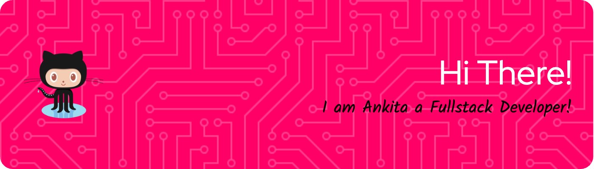
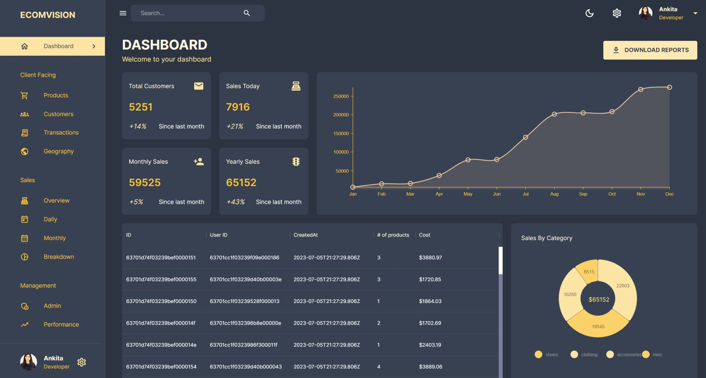
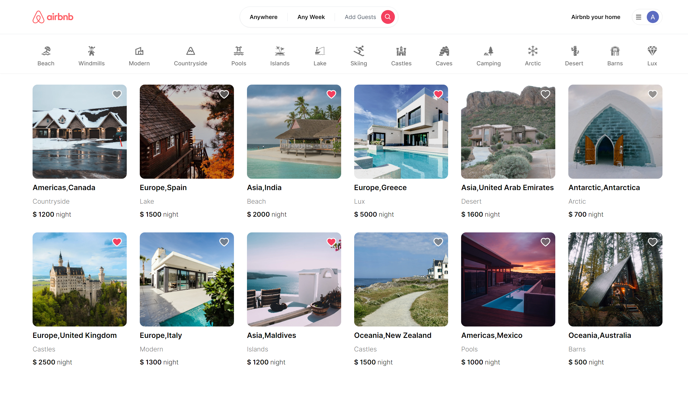
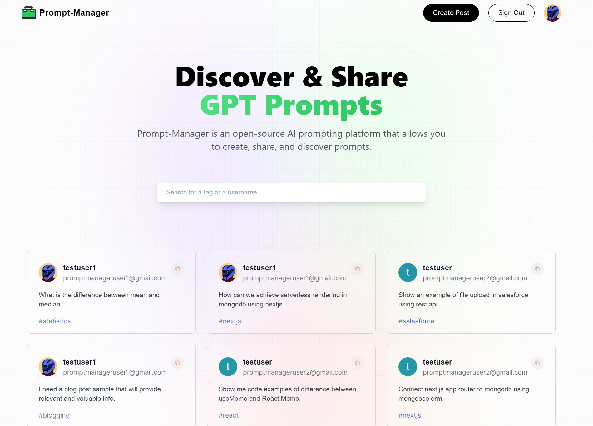

I am an Experienced Fullstack Developer with a demonstrated history of working in the information technology and services industry. Skilled in React JS, NextJS, NodeJS, MongoDB, Mean Stack, RESTfull API’s. I have experience of managing big devlopment teams and working directly with stake holders.

## My Recent Projects

### Admin Ecommerce Dashboard

[Project Link](https://admin-dashboard-frontend-ct0c.onrender.com/)

### Airbnb Clone

[Project Link](rental-application-ecru.vercel.app)

### Prompt Manager

[Project Link](https://prompt-manager-lime.vercel.app/)

<!--
**techexplorer1231/techexplorer1231** is a ✨ _special_ ✨ repository because its `README.md` (this file) appears on your GitHub profile.

Here are some ideas to get you started:

- 🔭 I’m currently working on ...
- 🌱 I’m currently learning ...
- 👯 I’m looking to collaborate on ...
- 🤔 I’m looking for help with ...
- 💬 Ask me about ...
- 📫 How to reach me: ...
- 😄 Pronouns: ...
- ⚡ Fun fact: ...
-->
